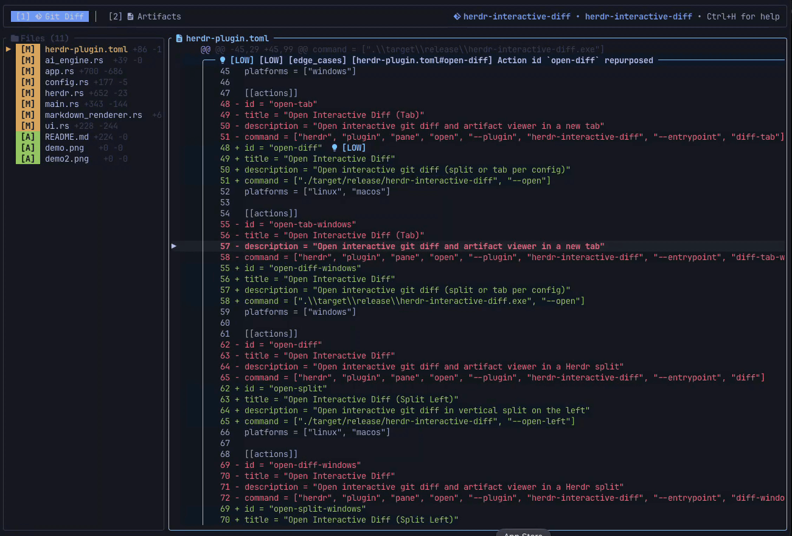

<h1 align="center">
<strong>Herdr Interactive Diff</strong>
</h1>

<p align="center">
    
    
</p>

`herdr-interactive-diff` is an **AI-augmented interactive Git Diff & Artifact Viewer plugin for [Herdr](https://github.com/herdr/herdr)**, engineered in Rust (`ratatui` + Tokio). It bridges your terminal workspace with dual AI coding agents (Antigravity CLI `agy`, Claude Code `claude`, and 15+ others) to deliver real-time interactive diff inspection, automated 5-lens PR reviews (Caveman style), anti-overengineering validation, and live artifact reading—all natively integrated with Herdr panes without terminal clutter.

---

<p align="center">
    
</p>

---

## ✨ Features

- **Interactive Git Diff TUI**: Clean side-drawer file navigation, diff hunk inspection, syntax-aware line rendering, toggle between Diff-Only and Full-File view (`f`), drawer collapse (`e`), mouse click & drag text selection, and native system clipboard integration (macOS `pbcopy`, OSC52).
- **Decoupled Herdr Agent Architecture**: Integrates directly with Herdr's Unix IPC socket (`$HERDR_SOCKET`). Discovers and binds to active AI agents across existing Herdr panes without spawning phantom agents or stealing pane authority.
- **Dual-AI Workflow (Primary + Review)**:
  - **Review AI (5-Lens PR Review)**: Dispatches your git diff to the Review AI pane for a structured 5-lens code review (**Security**, **Readability**, **Edge Cases**, **Maintainability**, **Architecture**) in telegraphic Caveman style. Hunk classifications (`High`, `Medium`, `Low` / `Curiosity`) are mapped directly back into the diff as inline framed comments and floating tooltips.
  - **Primary AI (Validation & Iteration)**: Injects review findings into your Primary AI (e.g., Antigravity `agy`) to challenge unnecessary abstractions, enforce YAGNI/simplicity, or ask pointwise questions (`?`) on specific diff hunks.
- **Live AI Artifacts & Markdown Engine**: Full-fidelity markdown reader for Antigravity (`agy`) and Claude Code conversation artifacts and transcripts. Renders GitHub-style alerts (`[!NOTE]`, `[!WARNING]`, `[!TIP]`, `[!IMPORTANT]`, `[!CAUTION]`), tables, code fences, and automatically discovers workspace sessions.
- **Configurable Workspace Placement**: Open via `<prefix>+f` as a vertical split on the left or in a dedicated tab (`--placement <split|tab>`), configurable via CLI or interactive setup wizard.
- **Broad Agent Ecosystem**: Native out-of-the-box support for 17 Herdr agents: `agy` (Antigravity), `claude`, `codex`, `copilot`, `devin`, `droid`, `kimi`, `opencode`, `kilo`, `hermes`, `qodercli`, `qwen`, `cursor`, `mastracode`, `grok`, `pi`, and `amp`.

---

## 🔧 Prerequisites: Nerd Fonts

`herdr-interactive-diff` uses [**Nerd Fonts**](https://www.nerdfonts.com/) glyphs for file icons, agent status badges, headers, and tabs:

### macOS

```bash
brew install --cask font-fira-code-nerd-font
```

### Linux

Download your preferred font from [nerdfonts.com/font-downloads](https://www.nerdfonts.com/font-downloads) and copy it to `~/.local/share/fonts/`:

```bash
fc-cache -fv
```

---

## ⌨️ Workflow & Keybindings

### 1. Herdr Prefix Commands

Add these keybindings to `~/.config/herdr/config.toml` for seamless terminal orchestration:

| Keybinding     | Action                | Description                                                               |
| :------------- | :-------------------- | :------------------------------------------------------------------------ |
| `<prefix> + f` | Open Interactive Diff | Opens diff viewer in vertical split (left) or tab per your config         |
| `<prefix> + a` | Focus Primary AI      | Jumps focus to the primary AI pane in current Herdr workspace             |
| `<prefix> + c` | Focus Review AI       | Jumps focus to the review AI pane in current Herdr workspace              |
| `<prefix> + r` | Trigger 5-Lens Review | Submits working diff to Review AI for multi-lens evaluation               |
| `<prefix> + s` | Trigger Validation    | Submits Review findings to Primary AI for anti-overengineering validation |

### 2. TUI Navigation & Shortcuts

#### Global Navigation

| Key              | Action                                                                  |
| :--------------- | :---------------------------------------------------------------------- |
| `1` / `F1`       | Switch to **[1] Git Diff** tab                                          |
| `2` / `F2`       | Switch to **[2] Artifacts** tab (available when artifacts exist)        |
| `Tab` / `Ctrl+T` | Cycle between active tabs                                               |
| `Ctrl+A`         | Open **Agent Picker** modal (assign Primary & Review AI to Herdr panes) |
| `Ctrl+R`         | Dispatch 5-Lens Code Review to Review AI pane                           |
| `Ctrl+S`         | Dispatch Review output to Primary AI pane for validation                |
| `Ctrl+H` / `F12` | Toggle Keybindings & Help modal                                         |
| `Ctrl+Q` / `q`   | Exit `herdr-interactive-diff`                                           |

#### Tab 1: Git Diff & Review Comments

| Key                   | Action                                                                |
| :-------------------- | :-------------------------------------------------------------------- |
| `j` / `k` / `↑` / `↓` | Navigate files (in drawer) or scroll lines (in code viewer)           |
| `f`                   | Toggle between **Diff Only** and **Full File** view mode              |
| `e` / `E`             | Toggle file tree drawer expand / collapse                             |
| `Space` / `Enter`     | Toggle floating review tooltip (Caveman / Insight)                    |
| `?`                   | Ask Primary AI a question regarding the selected diff hunk            |
| `Mouse Drag`          | Highlight and select code text                                        |
| `Cmd+C` / `Ctrl+C`    | Copy current selection or line to system clipboard (`pbcopy` / OSC52) |
| `r` / `F5`            | Reload Git Diff from disk                                             |

#### Tab 2: Workspace & AI Artifacts

| Key                   | Action                                                 |
| :-------------------- | :----------------------------------------------------- |
| `j` / `k` / `↑` / `↓` | Navigate artifact drawer or scroll markdown document   |
| `Enter` / `l` / `→`   | Focus document reading view                            |
| `Esc` / `h` / `←`     | Return focus to artifact drawer                        |
| `Mouse Drag`          | Select document text to copy to clipboard              |
| `r` / `F5`            | Reload artifacts from workspace and active AI sessions |

---

## ⚙️ Configuration & CLI

Configuration is stored in `~/.config/herdr/plugins/config/herdr-interactive-diff/config.json` (or `~/.config/herdr-interactive-diff/config.json`).

### Placement Configuration

Configure whether `<prefix>+f` opens the interactive diff in a vertical split on the left or in a dedicated tab:

```bash
# Open as a vertical split on the left (default)
herdr-interactive-diff --placement split

# Open as a dedicated new tab
herdr-interactive-diff --placement tab

# Display current configuration and bound agent panes
herdr-interactive-diff -c
```

### Dynamic Herdr Agent Discovery

You don't need to manually configure or launch AI agents from the CLI:
- `herdr-interactive-diff` communicates directly with Herdr's Unix IPC socket (`$HERDR_SOCKET`).
- It **automatically discovers** active AI agents (`agy`, `claude`, `copilot`, `cursor`, etc.) running in your workspace panes.
- Inside the diff viewer, press **`a`** to open the interactive **Agent Picker** modal:
  - Press `Tab` to switch between **Primary AI** and **Review AI**.
  - Navigate with `↑`/`↓` and press `Enter` to bind.
  - Selected panes and preferences are automatically remembered across sessions.

---

## 🚀 Installation & Herdr Setup

### 1. Install via Herdr Marketplace

Install `herdr-interactive-diff` directly from GitHub using the Herdr plugin manager:

```bash
herdr plugin install kalebhenrique/herdr-interactive-diff
```

### 2. Configure Herdr Keybindings

Add native `plugin_action` bindings to your `~/.config/herdr/config.toml`:

```toml
[[keys.command]]
key = "prefix+f"
type = "plugin_action"
command = "herdr-interactive-diff.open-diff"
description = "Open Interactive Diff (split or tab per config)"

[[keys.command]]
key = "prefix+a"
type = "plugin_action"
command = "herdr-interactive-diff.focus-primary"
description = "Focus Primary AI pane"

[[keys.command]]
key = "prefix+c"
type = "plugin_action"
command = "herdr-interactive-diff.focus-review"
description = "Focus Review AI pane"

[[keys.command]]
key = "prefix+r"
type = "plugin_action"
command = "herdr-interactive-diff.trigger-review"
description = "Dispatch 5-Lens Code Review to Review AI"

[[keys.command]]
key = "prefix+s"
type = "plugin_action"
command = "herdr-interactive-diff.trigger-validation"
description = "Inject anti-overengineering validation into Primary AI"
```

### 3. Local Development & Linking (Optional)

If you are developing or testing local changes:

```bash
git clone https://github.com/kalebhenrique/herdr-interactive-diff.git
cd herdr-interactive-diff
cargo build --release
herdr plugin link .
```

---

## 🧪 Testing & Development

Run the test suite (73+ unit and integration tests):

```bash
# Run all unit and integration tests
cargo test

# Run in mock demo mode (no real agents or git repository required)
cargo run -- --demo

# Run against a specific repository path
cargo run -- -p ~/path/to/repo
```

---

## 📄 License

MIT © [Kaleb Henrique](https://github.com/kalebhenrique)
